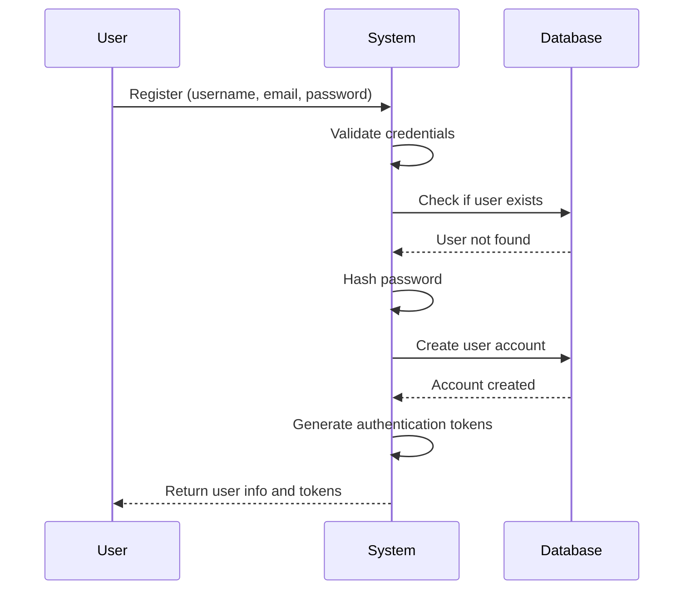
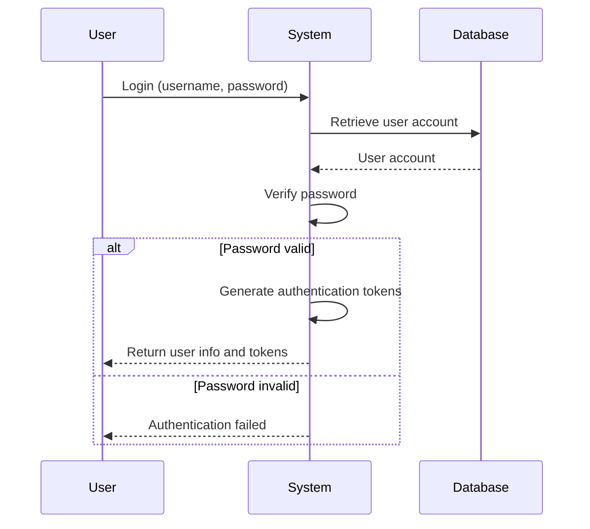
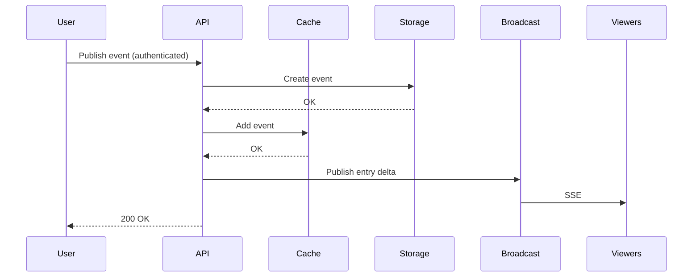
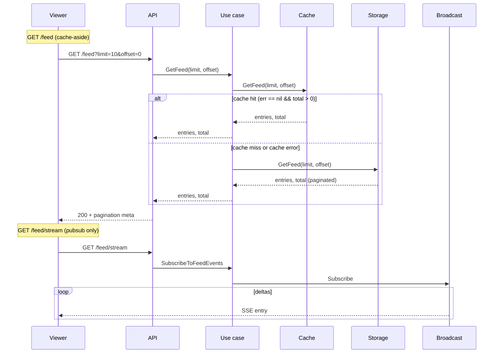

# Modules

The system is organized into self-contained modules, each following Clean Architecture principles.

For general application features and high-level flows, see [Application Features & Flows](./application.md).

## Auth Module

**Purpose**: User authentication and authorization

**Components**:
- **Domain**: `User` (`domain/user.go`), `TokenPair` (`domain/token.go`), domain errors (`domain/errors.go`)
- **Application**: `AuthUseCase` (`application/auth_usecase.go`), `UserRepository` interface (`application/repository.go`)
- **Adapters**: HTTP handlers (`adapters/rest/v1/handler.go`), error mapper (`adapters/rest/v1/error_mapper.go`)
- **Infrastructure**: PostgreSQL repository (`infrastructure/repository/postgres.go`), JWT manager (`infrastructure/jwt/jwt.go`)

For architectural details, see [Architecture](./architecture.md).

**Endpoints**:
- `POST /api/v1/auth/register` - User registration (public)
- `POST /api/v1/auth/login` - User login (public)
- `POST /api/v1/auth/refresh` - Refresh access token (public)
- `GET /api/v1/auth/me` - Get current user information (protected, requires authentication)

### User Registration Flow

**What Happens**:
1. User provides registration information
2. System validates and checks for existing accounts
3. Password is securely hashed
4. User account is created
5. Authentication tokens are generated
6. User receives account information and tokens

### User Login Flow

**What Happens**:
1. User provides login credentials
2. System retrieves user account
3. Password is verified
4. If valid, authentication tokens are generated and returned
5. If invalid, authentication error is returned

### Token Management

The system implements JWT-based authentication with automatic token management:

**Token Types**:
- **Access Token**: Short-lived token for API authentication (validated on every request)
- **Refresh Token**: Long-lived token for obtaining new access tokens

**Token Management Features**:
- **Proactive Refresh**: Tokens are automatically refreshed before expiration (configurable buffer time, default: 5 minutes)
- **Expiration Checking**: Token expiration is checked before making API requests
- **Automatic Retry**: Failed requests due to expired tokens are automatically retried after refresh
- **Secure Storage**: Tokens are stored securely in browser localStorage (SPA)
- **User Info Management**: User information is stored separately from tokens (no client-side JWT decoding)

**Current User Endpoint**:
- `GET /api/v1/auth/me` - Returns current authenticated user's information
- Requires valid JWT token in Authorization header
- Provides single source of truth for user information
- Used by SPA to fetch user info without decoding JWT tokens

**SPA Authentication Best Practices**:
- No client-side JWT decoding for user data extraction
- User information retrieved from API endpoints only
- Automatic token refresh prevents failed requests
- Proper error handling for authentication failures
- Token validation on all protected endpoints

## Feed Module

**Purpose**: event publishing and real-time feed queries via Server-Sent Events (SSE)

**Data layer**: PostgreSQL = persistence; Redis = cache. All cache/persistence logic lives in use cases; handlers only invoke use cases.

**Components**:
- **Domain**: `FeedEvent` (`domain/feed_event.go`), constants (`domain/constants.go`)
- **Application**:
  - `FeedUseCase` - `GetFeed(limit, offset)`, `SubscribeToFeedEvents()`
  - `eventUseCase` - `PublishEvent()` (persist to PostgreSQL, then best-effort cache and broadcast)
  - Repository interfaces: `FeedRepository`, `FeedCacheRepository`, `UserRepository` (module-owned), `BroadcastService`
- **Adapters**: HTTP handlers, error mapper
- **Infrastructure**: PostgreSQL (persistence) and Redis (cache) repositories, Redis broadcast service

**Repository Interface Methods**:
- `FeedCacheRepository.GetFeed(limit, offset)` - Returns paginated entries and total count in a single call
- `FeedRepository.GetFeed(limit, offset)` - Returns paginated entries and total count (uses SQL LIMIT/OFFSET and COUNT(*) OVER())

**Endpoints**:
- `GET /api/v1/feed?limit=10&offset=0` - Paginated feed (cache-aside: cache first, PostgreSQL fallback)
- `GET /api/v1/feed/stream` - SSE stream for entry deltas only (pubsub, no cache/persistence reads)
- `POST /api/v1/events` - Publish event (persists first; requires auth)

**Module Independence**: Owns its `UserRepository` interface (no dependency on auth module). See [Architecture - Module Independence](./architecture.md#module-independence).

### event publish Flow (persist + broadcast)

### Feed Viewing Flow

**Behavior**:
- **GET /feed**: Cache-aside strategy with three distinct paths:
  - **Cache hit** (`err == nil && total > 0`): Returns cached entries immediately.
  - **Cache error** (`err != nil`): Uses persistence directly with the requested `limit` and `offset`.
  - **Cache miss** (`err == nil && total == 0`): Uses persistence directly with the requested `limit` and `offset`.
- **GET /feed/stream**: Pubsub only. Use case: `SubscribeToFeedEvents` (no cache or persistence). Handler: set SSE headers, call `SubscribeToFeedEvents`, loop on channel. Clients must load initial state via GET /feed first.
- **POST /events**: Persists the event first, then performs best-effort cache and broadcast updates via `PublishEvent`.

**UI Behavior**:
- When a new event is published, the UI refreshes the visible feed window so the newest events remain in view and the paginated list stays aligned with the shared newest-first ordering.

**Characteristics**: Cache-aside for reads and PostgreSQL-first writes; stream is pubsub-only; Redis retains the most recent `1000` feed items; `/feed` and `/feed/stream` are independent.

### Infrastructure

**Redis (cache)**:
- List `feed:recent`: JSON-encoded `FeedEvent` entries. `LPUSH`, `LTRIM`, `LLEN`, `LRANGE`.
- `GetFeed(limit, offset)`: Uses `LRANGE` for paginated entries and `LLEN` for total count.
- Pub/sub `feed:viewer:updates`: entry-delta JSON for live feed updates.

**PostgreSQL (persistence)**: 
- `activity_feed_events` table; `CreateEvent`, `GetFeed(limit, offset)`.
- `GetFeed` uses SQL `LIMIT`/`OFFSET` for pagination and `COUNT(*) OVER()` window function to get total count in the same query. Results are ordered by `created_at DESC, id DESC`.

