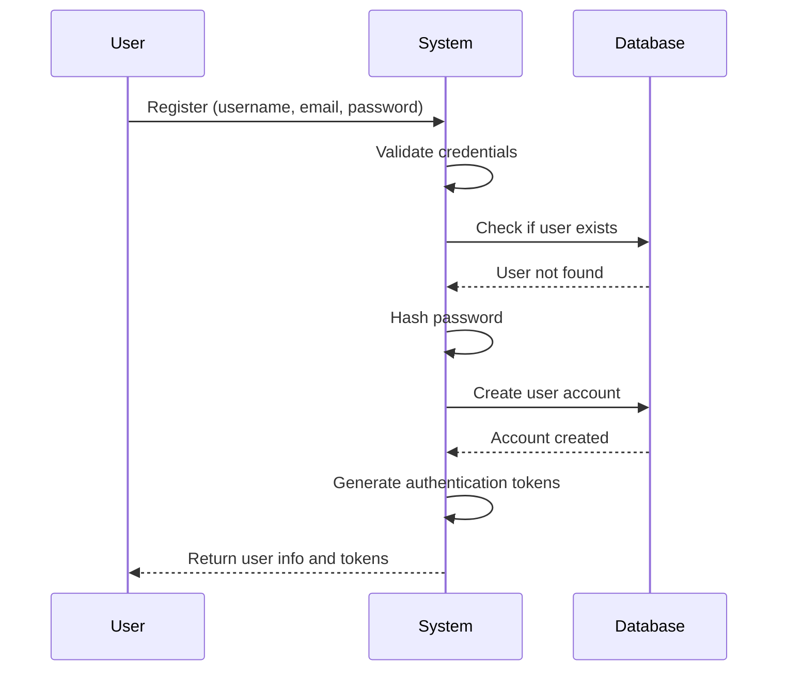
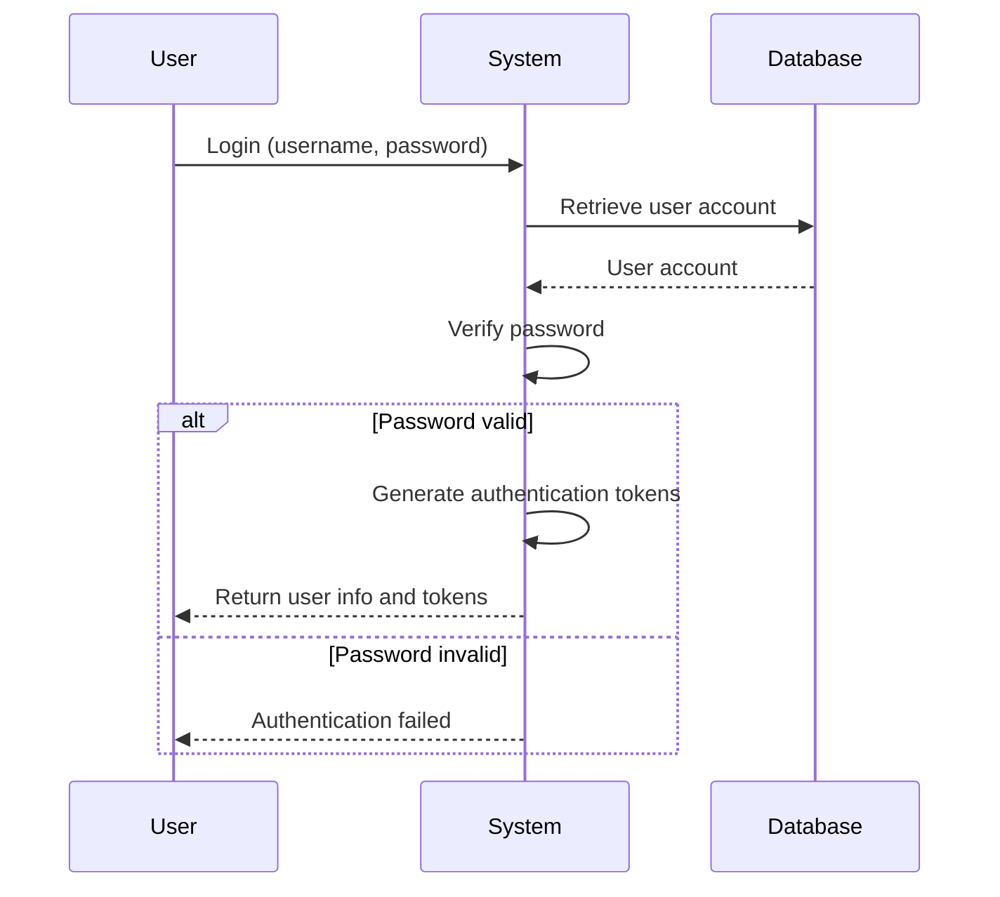
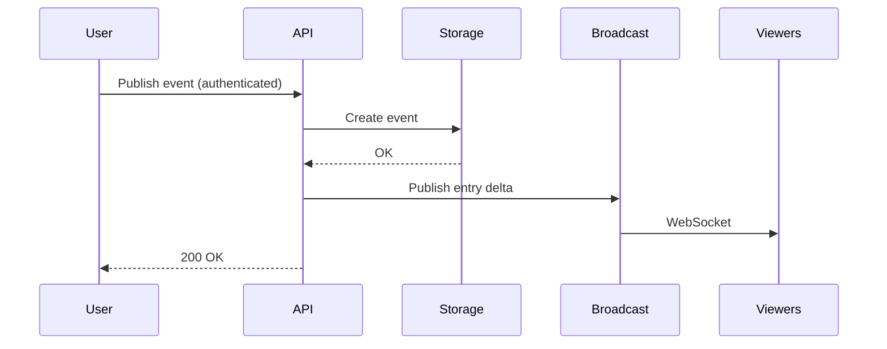
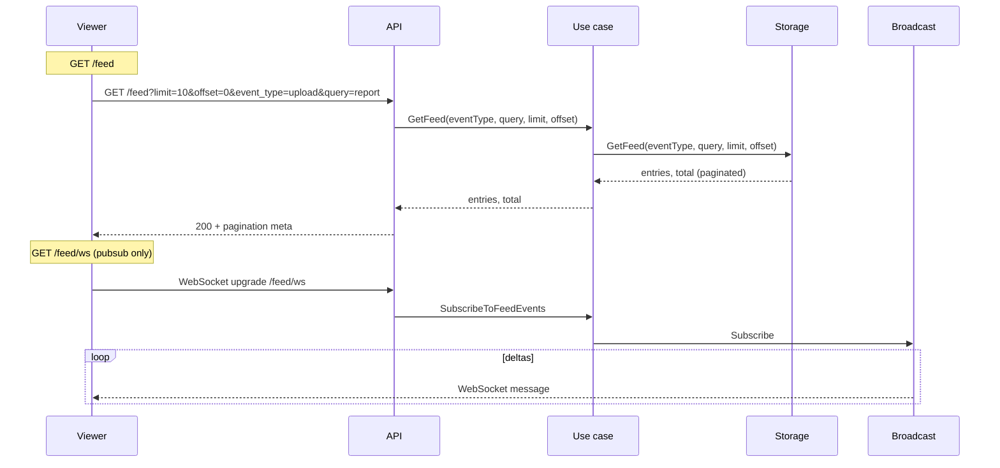

# Modules

The system is organized into self-contained modules, each following Clean Architecture principles.

For general application features and high-level flows, see [Application Features & Flows](./application.md).

## Auth Module

**Purpose**: User authentication and authorization

**Components**:
- **Domain**: `User` (`domain/user.go`), `TokenPair` (`domain/token.go`), domain errors (`domain/errors.go`)
- **Application**: `AuthUseCase` (`application/auth_usecase.go`), `UserRepository` interface (`application/repository.go`)
- **Adapters**: HTTP handlers (`adapters/rest/v1/handler.go`), error mapper (`adapters/rest/v1/error_mapper.go`)
- **Infrastructure**: PostgreSQL repository (`infrastructure/repository/postgres.go`), JWT manager (`infrastructure/jwt/jwt.go`)

For architectural details, see [Architecture](./architecture.md).

**Endpoints**:
- `POST /api/v1/auth/register` - User registration (public)
- `POST /api/v1/auth/login` - User login (public)
- `POST /api/v1/auth/refresh` - Refresh access token (public)
- `GET /api/v1/auth/me` - Get current user information (protected, requires authentication)

### User Registration Flow

**What Happens**:
1. User provides registration information
2. System validates and checks for existing accounts
3. Password is securely hashed
4. User account is created
5. Authentication tokens are generated
6. User receives account information and tokens

### User Login Flow

**What Happens**:
1. User provides login credentials
2. System retrieves user account
3. Password is verified
4. If valid, authentication tokens are generated and returned
5. If invalid, authentication error is returned

### Token Management

The system implements JWT-based authentication with automatic token management:

**Token Types**:
- **Access Token**: Short-lived token for API authentication (validated on every request)
- **Refresh Token**: Long-lived token for obtaining new access tokens

**Token Management Features**:
- **Proactive Refresh**: Tokens are automatically refreshed before expiration (configurable buffer time, default: 5 minutes)
- **Expiration Checking**: Token expiration is checked before making API requests
- **Automatic Retry**: Failed requests due to expired tokens are automatically retried after refresh
- **Secure Storage**: Tokens are stored securely in browser localStorage (SPA)
- **User Info Management**: User information is stored separately from tokens (no client-side JWT decoding)

**Current User Endpoint**:
- `GET /api/v1/auth/me` - Returns current authenticated user's information
- Requires valid JWT token in Authorization header
- Provides single source of truth for user information
- Used by SPA to fetch user info without decoding JWT tokens

**SPA Authentication Best Practices**:
- No client-side JWT decoding for user data extraction
- User information retrieved from API endpoints only
- Automatic token refresh prevents failed requests
- Proper error handling for authentication failures
- Token validation on all protected endpoints

## Feed Module

**Purpose**: event publishing and real-time feed queries via WebSocket

**Data layer**: PostgreSQL = persistence and feed history; Redis = pub/sub transport for live updates. Handlers only invoke use cases.

**Components**:
- **Domain**: `FeedEvent` (`domain/feed_event.go`), fixed event types (`domain/event_types.go`), constants (`domain/constants.go`)
- **Application**:
  - `FeedUseCase` - `GetFeed(eventType, limit, offset)`, `SubscribeToFeedEvents()`
  - `eventUseCase` - `PublishEvent()` (validate fixed event type, persist to PostgreSQL, then broadcast)
  - Repository interfaces: `FeedRepository`, `UserRepository` (module-owned), `BroadcastService`
- **Adapters**: HTTP handlers, WebSocket upgrade handler, error mapper
- **Infrastructure**: PostgreSQL persistence and Redis broadcast service

**Repository Interface Methods**:
- `FeedRepository.GetFeed(eventType, query, limit, offset)` - Returns paginated entries and total count, with optional event-type filtering and text search across usernames and messages

**Endpoints**:
- `GET /api/v1/feed?limit=10&offset=0&event_type=upload&query=report` - Paginated feed from PostgreSQL with combined event-type filtering and text search
- `GET /api/v1/feed/event-types` - Supported fixed event types for publish and filter dropdowns
- `GET /api/v1/feed/ws` - WebSocket for entry deltas only (pubsub, no cache/persistence reads)
- `POST /api/v1/events` - Publish event (persists first; requires auth)

**Module Independence**: Owns its `UserRepository` interface (no dependency on auth module). See [Architecture - Module Independence](./architecture.md#module-independence).

### event publish Flow (persist + broadcast)

### Feed Viewing Flow

**Behavior**:
- **GET /feed**: Reads the requested page directly from PostgreSQL, optionally filtered by fixed `event_type` and `query`. Search matches `content` and `username`.
- **GET /feed/event-types**: Returns the fixed list of supported event types so the SPA can render publish and filter dropdowns without duplicating backend rules.
- **GET /feed/ws**: Pubsub only. Use case: `SubscribeToFeedEvents` (no persistence reads). Handler: upgrade to WebSocket, subscribe, and push JSON entry messages. Clients must load initial state via `GET /feed` first.
- **POST /events**: Validates the fixed event type, persists the event first, then broadcasts the live delta via `PublishEvent`.

**UI Behavior**:
- Event publishing uses a fixed event-type dropdown instead of a free-text input.
- The main feed can be filtered by event type using a backend-driven dropdown sourced from `GET /feed/event-types`.
- The main feed supports text search across usernames and messages, and search can be combined with the event-type filter.
- When a new event is published, the UI refreshes the visible feed window so the newest events remain in view and the paginated list stays aligned with the shared newest-first ordering.

**Characteristics**: PostgreSQL is the source of truth for feed history; live stream is pubsub-only; Redis is used for transport rather than feed history; `/feed` and `/feed/ws` are independent.

### Infrastructure

**Redis (transport)**:
- Pub/sub `feed:viewer:updates`: entry-delta JSON for live feed updates.

**PostgreSQL (persistence)**: 
- `activity_feed_events` table; `CreateEvent`, `GetFeed(eventType, query, limit, offset)`.
- `GetFeed` uses SQL `LIMIT`/`OFFSET` for pagination, optional `event_type` filtering, and optional `ILIKE` search over `content` and `username`, with `COUNT(*) OVER()` to get total count in the same query. Results are ordered by `created_at DESC, id DESC`.
- Search tuning uses `pg_trgm` GIN indexes on `activity_feed_events.content` and `users.username`, plus a composite `(event_type, created_at DESC, id DESC)` index for combined filtering and ordering.

